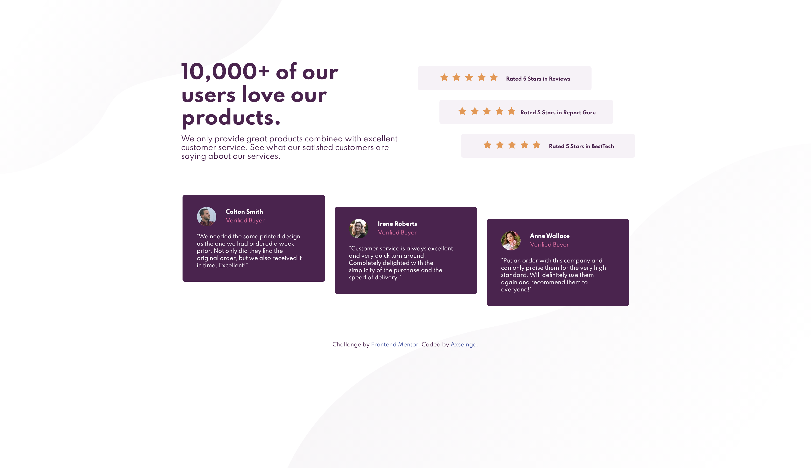

# Frontend Mentor - Social proof section solution

This is a solution to the [Social proof section challenge on Frontend Mentor](https://www.frontendmentor.io/challenges/social-proof-section-6e0qTv_bA). Frontend Mentor challenges help you improve your coding skills by building realistic projects.

## Table of contents

- [Overview](#overview)
  - [The challenge](#the-challenge)
  - [Screenshot](#screenshot)
  - [Links](#links)
- [My process](#my-process)
  - [Built with](#built-with)
  - [What I learned](#what-i-learned)
  - [Useful resources](#useful-resources)
- [Author](#author)
- [Acknowledgments](#acknowledgments)

## Overview

### The challenge

Users should be able to:

- View the optimal layout for the section depending on their device's screen size

### Screenshot

### Links

- [Check my solution](https://github.com/axseinga/social-proof-section)
- [Check Site Live](https://axseinga.github.io/social-proof-section)

## My process

### Built with

- Semantic HTML5 markup
- CSS custom properties
- SASS
- Flexbox
- BEM pattern
- Mobile-first workflow

### What I learned

I tried to complete this challenge not longer than a month ago and fail completely. I could have not figure out how to structure the layout so everything works nice and is responsive. I moved to other challenges to learn more about creating design and today here I am back! I had a chance to prove myself the progress in CSS layouts. The challenge did not took me long to finish and I had an opportunity to master Flexbox and work with background images once again. First time I approached building HTML structure from the smallest components and it worked for me fine this time.

### Useful resources

- [A Complete Guide to Flexbox](https://css-tricks.com/snippets/css/a-guide-to-flexbox/) - This is a real saver when working out with Flexbox!

## Author

- Github - [Axseinga](https://github.com/axseinga)
- Frontend Mentor - [@axseinga](https://www.frontendmentor.io/profile/axseinga)
